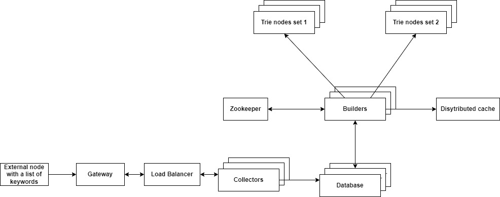

## Approach
Given a prefix, we need to offer up to 4 suggestions from the list of keywords. A trie is a good fit for this problem.
A pre-order traversal of the trie can help us return the results in alphabetical order.

### Assumptions
- Case-insensitive.

### Algorithm
1. Create the trie from the given list of keywords.
2. Move the current node to the end of the prefix on the trie.
3. Traverse the trie in a depth first search manner, starting from the current node, and add encountered complete words to
the results. Once we have 4 suggestions, end the search.
4. Return the list of suggestions.

### Complexity
- Time complexity: It takes O(M) to build the trie, where M is the number of characters in the list of keywords. We can
find the node representing a prefix in O(len(prefix)). Finally, the DFS to return the list of suggestions is a
O(L) operation, where L is the length of the longest word in the keywords list. To summarize, O(M) to build the trie,
and O(L) to return suggestions.
- Space complexity: O(n), where n is the number of nodes in the trie.

## Requirements
Ensure you can run Python from the command line:
```sh
py --version
```
Ensure you can run pip from the command line:
```sh
py -m pip --version
```
Install the requirements:
```sh
make init
```

## Installing the package locally
```sh
make dev
```

## Running the tests
```sh
make test
```

## Additional questions
1. What would you change if the list of keywords was much larger (300 Gb)? Please explain and describe the concepts that
would allow to handle this if you decide to use specific tools (frameworks, databases…)?

#### Functional Requirements
Given a list of keywords, offer up to 4 suggested keywords from the list, starting with the letters typed,
case-insensitive.

The results must be in alphabetical order.

#### Non-functional Requirements
- Low latency in order to create a real-time experience.

- High availability.

- Scalability.

- Durability.

#### Requests flow


We split the list of keywords among different trie nodes' sets, and these nodes have replicas as well.

When the user enters something in the search bar, the request goes through the gateway to the load balancer, which
forwards it to an available application server. Given a prefix, the application server tries to fetch suggestions from
the distributed cache. In case of failure, it communicates with the Zookeeper to locate the trie node to access for the
prefix in hand. The application server returns the results to the load balancer before updating the cache as well.
#### Updates flow


In order to improve efficiency, we precompute the top 4 suggestion for every prefix in the trie (This is performed by
the Builder servers). It is possible to have some nodes in the bottom of the trie which have less than 4 suggestions.

Assuming that the list of keywords is already provided, our Collector server stores the list in a hashtable in
our database. This process has to be done periodically (every hour for example) to fetch the updated list of keywords.
The builder server loads periodically the list of keywords from the database and builds a new trie (we can have more
than one builder working in parallel on different ranges of the alphabet: a -> h and i ->p...). Once the trie is ready,
it is made available for use through the Zookeeper, any new requests are directed to the new trie.
#### Metrics
We can collect different metrics from the user and the system to assess whether we are successful or not with our
design:
- Efficacy of the list of suggestions.
- The cache hit ratio.
- Latency and availability.

2. What would you change if the requirements were to match any portion of the keywords (for example, given the string
“pro”, the program could suggest the keyword “reprobe”)?

A Generalized Suffix Tree is a good fit for this problem. We can use Ukkonen's algorithm to build the tree in linear
time.

Given a list of keywords P = {S1, S2, ..., Sn}, an easier way to build a generalized suffix tree for P is to append a
different string end marker to each keyword, then concatenate all the strings together, and build a suffix tree for the
concatenated string. For leaf nodes, remove any text after the first marker.

To match a portion q of the keywords, move the current node to the end of q in the generalized suffix tree. Then,
traverse the tree below the current node (Using DFS for example), and add Si to the list of suggestions if you find a
string containing the end marker of Si.

Concepts of design from question 1 could be used for large list of keywords.